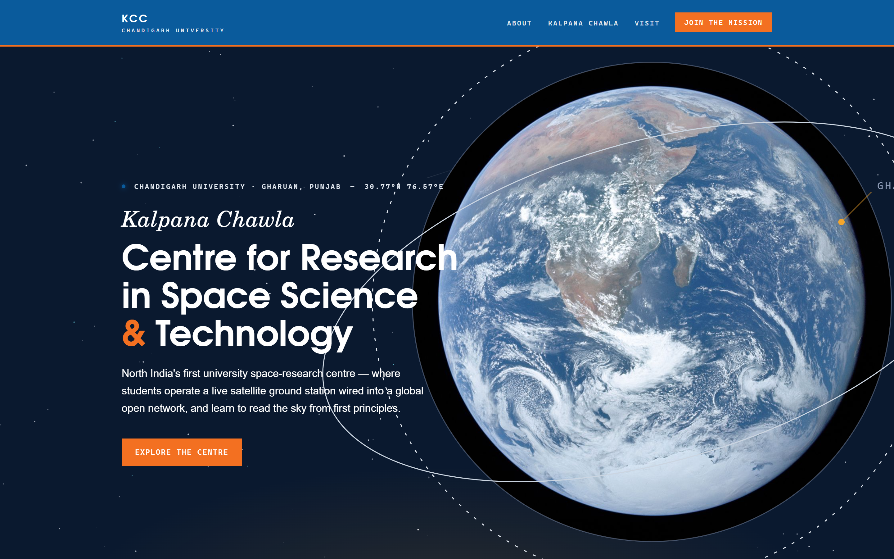

# KC-CRSST — Kalpana Chawla Centre for Research in Space Science & Technology

Concept website for the **Kalpana Chawla Centre for Research in Space Science & Technology
(KC-CRSST)** at Chandigarh University, Gharuan — the university's space-research centre,
ground control station for the CUSAT student satellite, and geospatial research hub.



**Live site:** https://humanoidr6.github.io/kcc-website/
**Full-page preview:** [docs/screenshots/full-page.jpg](docs/screenshots/full-page.jpg) · [mobile](docs/screenshots/mobile-hero.png)

---

## What this is

A single-file, self-contained website (`index.html`) built for a college assignment at
Chandigarh University. Everything — CSS, JavaScript, both typefaces, every graphic — is
embedded in that one file (~85 KB). There is **no build step, no framework, no external
request**: it works offline, from a USB stick, or on any static host.

All facts on the page come from public sources at the centre's January 2022 commissioning
(see [Content sources](#content-sources)). It is labeled in the footer as a student concept
site, **not** the official Chandigarh University website.

## Quick start

```bash
# just open it
xdg-open index.html          # Linux
# or double-click index.html in any file manager
```

To develop: edit `index.html` in any editor, refresh the browser. That's the whole loop.

## Repository layout

```
index.html                    ← the entire website (source of truth)
README.md                     ← this file
DESIGN.md                     ← design system, embedded-font pipeline, testing recipe
TODO.md                       ← roadmap for continuing the work
docs/screenshots/             ← reference renders used in the docs
```

## Editing guide

`index.html` is one document in three parts: a `<style>` block, the HTML sections in page
order, and one `<script>` block at the end. Find content by its anchor:

| Section | Find |
|---|---|
| Sticky navigation | `<header id="hdr">` |
| Hero + orbital diagram | `id="hero"` |
| Mono data strip | `class="datastrip"` |
| Stats band (380+ / 810+ / 50+ / 75) | `class="stats"` — numbers live in `data-count` attributes |
| About + commissioning card | `id="about"` |
| Kalpana Chawla tribute | `id="kalpana"` |
| CUSAT satellite + applications | `id="cusat"` |
| Ground station console + track panel | `id="groundstation"` |
| Four labs | `id="facilities"` |
| Research areas + 57-countries band | `id="research"` |
| Mission log (timeline) | `aria-label="Mission log"` |
| Visit / address / links | `id="visit"` |
| Footer + sources + disclaimer | `<footer>` |

Common edits:

- **Change a colour**: edit the custom properties in `:root` at the top of `<style>`
  (`--saffron`, `--signal`, `--void`, `--ink`, `--muted`…). Everything derives from them.
- **Change a statistic**: update the `data-count="…"` value *and* its label text.
- **Add a section**: copy an existing `<section>` block — the `wrap` container,
  `eyebrow` + `h2` header pattern, and `rv` reveal classes are all reusable.
- **Navigation**: nav links live in `id="navlinks"`; keep them in page order.

Before touching layout CSS, read the **Cascade gotchas** section of [DESIGN.md](DESIGN.md) —
it documents a real bug we hit.

## Deploying

The repo is set up for **GitHub Pages** (Settings → Pages → deploy from `main`, root).
Every push to `main` redeploys the live site automatically within a minute or two.

Any other static host works identically: Netlify/Vercel (drag the folder), or the
university's own web server (copy `index.html`).

## Content sources

Figures reflect the centre **as commissioned in January 2022**:

- [PIB press release, 3 Jan 2022](https://www.pib.gov.in/PressReleasePage.aspx?PRID=1787104) —
  inauguration by Raksha Mantri Rajnath Singh, ₹3.5 crore investment, CUSAT ground control role,
  SatNOGS reach (380+ satellites, 810+ transmitters, 50+ countries), 57-country training plan
- [CU Newsroom](https://news.cuchd.in/2022/01/defence-minister-rajnath-singh.html) — event coverage
- [CU research centres page](https://www.cuchd.in/research/center-of-research.php) — the four labs
  (ground station, model rocketry, star gazing, geospatial technologies) and research areas
- [CUSAT programme announcement, May 2021](https://news.cuchd.in/2021/05/CU-launches-satellite-designing-programme-CUSAT.html)

**Before presenting as official**: have the centre verify current figures, and add real
photographs, faculty/team names and contact details — see [TODO.md](TODO.md).

## Credits

Built by a Chandigarh University student. The site's footer carries the
dedication: *built with respect for the memory of Kalpana Chawla (1962–2003).*
